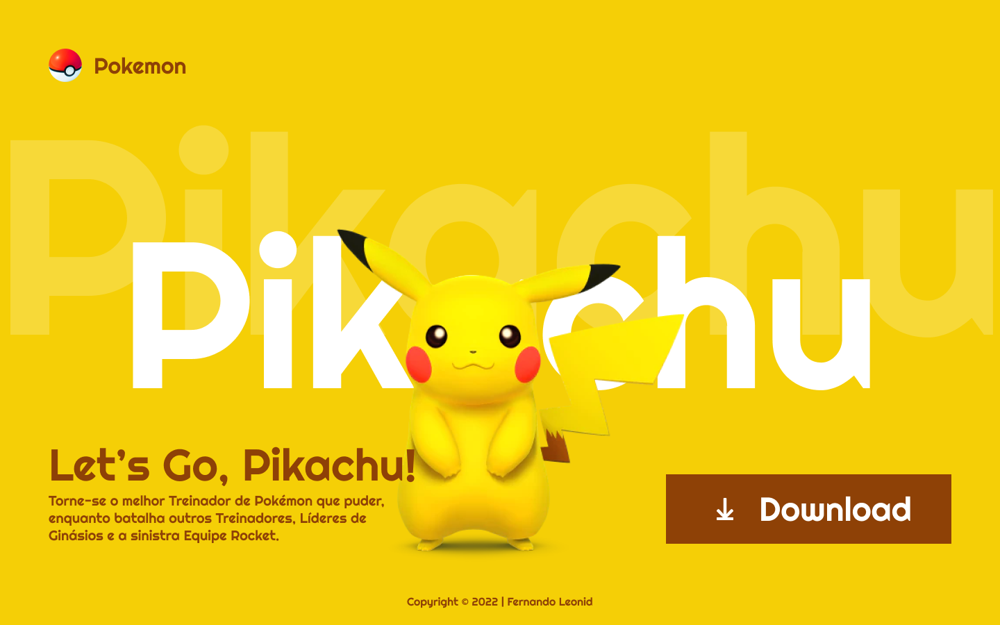

# **LANDING PAGE PIKACHU** 

[Clique aqui](https://cotilen.github.io/landing-page-pikachu/) para acessar o site

 

## **SOBRE**
- Site do tipo Landing page com o intuito de promover o novo jogo do Pokémon.
    
- - Foi construído o projeto em sala de aula em conjunto com o professor de Linguagem de Marcação da instuição [SENAI JANDIRA](https://jandira.sp.senai.br/) com o intuito de aplicar conceitos de responsividade.

## **TECNOLOGIAS APLICADAS**
- HTML5
- CSS3

## **FERRAMENTAS**
- VSCODE
- GITHUB / GIT
- FIGMA

## **CONCEITOS APLICADOS**
- UNIDADES (REM, EM, %, VH, VW)
- DISPLAY (GRID)
- EIXO DE PROFUNDIDADE (Z-INDEX)
- @MEDIA (RESPONSIVIDADE)

## **AUTOR**

- [Cleiton Cruz](https://github.com/cotilen)
